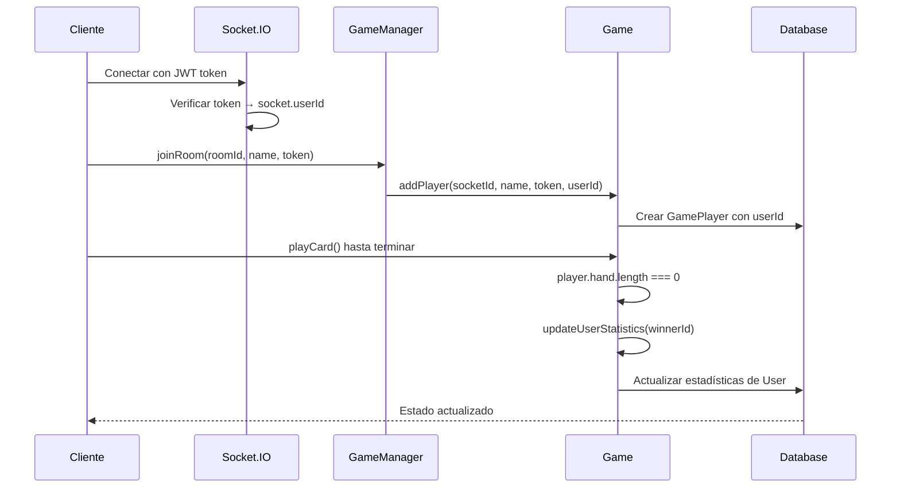

# 🎮 Integración de Autenticación con Partidas

## ✅ Implementación Completada

### 📋 Resumen

Se integró el sistema de autenticación con las partidas para que:

- Los usuarios autenticados tengan sus estadísticas rastreadas automáticamente
- Los invitados puedan jugar sin restricciones (userId = null)
- Las estadísticas se actualicen al finalizar cada partida

---

## 🔧 Cambios Implementados

### 1. **Cliente (Frontend)**

#### `src/App.jsx`

```javascript
// Importar hook de autenticación
import { useAuth } from "./contexts/AuthContext";

// Obtener token JWT
const { getToken } = useAuth();

// Enviar token al conectar con Socket.IO
useEffect(() => {
  const authToken = getToken();
  const instance = io(SOCKET_URL, {
    // ... otras opciones
    auth: {
      token: authToken, // JWT enviado automáticamente
    },
  });
  // ...
}, [getToken]);
```

**Resultado**: Cuando un usuario autenticado se conecta, su token JWT se envía automáticamente al servidor.

---

### 2. **Servidor (Backend)**

#### `server/index.js`

```javascript
// Importar utilidad de verificación
import { verifyToken } from "./auth/jwt.js";

// Middleware de Socket.IO para autenticación
io.use((socket, next) => {
  const token = socket.handshake.auth?.token;

  if (token) {
    try {
      const decoded = verifyToken(token);
      socket.userId = decoded.userId; // Adjuntar userId al socket
      console.log(
        `Socket ${socket.id} autenticado como userId: ${decoded.userId}`
      );
    } catch {
      console.log(
        `Token inválido para socket ${socket.id}, continuando como invitado`
      );
      socket.userId = null;
    }
  } else {
    socket.userId = null; // Usuario invitado
  }

  next();
});
```

**Resultado**: Cada socket ahora tiene un `socket.userId` que puede ser:

- `number` (ID del usuario autenticado)
- `null` (invitado/guest)

---

#### `server/gameManager.js`

```javascript
joinRoom(socket, { roomId, name, token }) {
  // ... código existente

  // Pasar userId del socket autenticado al juego
  const userId = socket.userId || null;
  const { player, previousId } = room.game.addPlayer(
    socket.id,
    name,
    token,
    userId  // ← Nuevo parámetro
  );

  // ... resto del código
}
```

**Resultado**: El userId se pasa al crear/unir jugadores a una partida.

---

#### `server/game.js`

##### Modificación en `addPlayer()`

```javascript
addPlayer(socketId, name, providedToken, userId = null) {
  // ... código de reconexión

  const player = {
    id: socketId,
    token: uuidv4(),
    name: displayName,
    hand: [],
    declaredLastCard: false,
    connected: true,
    userId, // ← Asociar userId con el jugador
  };

  // ...
}
```

##### Modificación en `playCard()` - Cuando termina la partida

```javascript
if (!player.hand.length) {
  this.phase = "finished";
  this.winnerId = player.id;
  this.lastAction = `${player.name} ganó la partida. ¡Felicitaciones!`;
  this.log(this.lastAction);
  this.broadcast();

  // ← NUEVO: Actualizar estadísticas de usuarios
  this.updateUserStatistics(player.id).catch((err) =>
    console.error("Error actualizando estadísticas:", err)
  );

  this.addAction("finish", playerId, this.lastAction).catch((err) =>
    console.error("Error agregando acción de finalización:", err)
  );
  return;
}
```

##### Nuevo método: `updateUserStatistics()`

```javascript
async updateUserStatistics(winnerPlayerId) {
  if (!User || !GameAction || !this.dbGameId) {
    return;
  }

  try {
    console.log(`📊 Actualizando estadísticas para partida ${this.roomId}...`);

    // Calcular duración de la partida
    const duration = this.startedAt
      ? Math.floor((Date.now() - this.startedAt) / 1000)
      : 0;

    // Obtener todas las acciones del juego
    const actions = await GameAction.findAll({
      where: { gameId: this.dbGameId },
    });

    // Procesar cada jugador
    for (const player of this.players) {
      if (!player.userId) {
        console.log(`   ⏭️  Jugador ${player.name} es invitado, saltando`);
        continue; // Saltar invitados
      }

      const user = await User.findByPk(player.userId);
      if (!user) {
        console.log(`   ⚠️  Usuario ${player.userId} no encontrado`);
        continue;
      }

      // ✅ Incrementar partidas jugadas
      user.gamesPlayed += 1;

      // ✅ Si este jugador ganó, incrementar victorias
      if (player.id === winnerPlayerId) {
        user.gamesWon += 1;
      }

      // ✅ Contar cartas especiales jugadas
      const gamePlayerId = this.dbPlayerIds.get(player.id);
      const playerActions = actions.filter(
        (action) => action.gamePlayerId === gamePlayerId && action.cardPlayed
      );

      for (const action of playerActions) {
        try {
          const card = JSON.parse(action.cardPlayed);

          // Contar cartas especiales
          if (card.value === 2) user.specialCards2 += 1;
          if (card.value === 4) user.specialCards4 += 1;
          if (card.value === 10) user.specialCards10 += 1;
          if (card.value === 11) user.specialCards11 += 1;
          if (card.value === 12) user.specialCards12 += 1;
        } catch {
          // Ignorar si no se puede parsear la carta
        }
      }

      // ✅ Contar jodetes usados
      const jodeteActions = actions.filter(
        (action) =>
          action.gamePlayerId === gamePlayerId &&
          action.actionType === "jodete"
      );
      user.jodetesUsed += jodeteActions.length;

      // ✅ Sumar tiempo total de juego
      user.totalPlayTime += duration;

      // Guardar cambios
      await user.save();
      console.log(`   ✅ ${user.displayName}: ${user.gamesPlayed} partidas, ${user.gamesWon} ganadas`);
    }

    console.log(`📊 Estadísticas actualizadas correctamente`);
  } catch (error) {
    console.error(`Error actualizando estadísticas de usuarios:`, error.message);
  }
}
```

**Resultado**: Al finalizar cada partida, las estadísticas de todos los usuarios autenticados se actualizan automáticamente.

---

## 📊 Estadísticas Rastreadas

Para cada usuario autenticado, se rastrean:

| Estadística           | Descripción                     | Campo BD         |
| --------------------- | ------------------------------- | ---------------- |
| **Partidas Jugadas**  | Total de partidas completadas   | `gamesPlayed`    |
| **Partidas Ganadas**  | Victorias                       | `gamesWon`       |
| **Cartas Especiales** | Dos (roba 2) jugados            | `specialCards2`  |
|                       | Cuatro (salto) jugados          | `specialCards4`  |
|                       | Diez (cambio palo) jugados      | `specialCards10` |
|                       | Once (bloqueo) jugados          | `specialCards11` |
|                       | Doce (cambio dirección) jugados | `specialCards12` |
| **Jodetes**           | "¡Jodete!" dichos a otros       | `jodetesUsed`    |
| **Tiempo Total**      | Segundos jugados                | `totalPlayTime`  |

---

## 🧪 Cómo Probar

### 1. **Usuario Autenticado**

1. Iniciar sesión con Google
2. Crear/unirse a una partida
3. Jugar hasta terminar la partida
4. Verificar en la base de datos:

```sql
SELECT
  "displayName",
  "gamesPlayed",
  "gamesWon",
  "specialCards2",
  "specialCards4",
  "jodetesUsed",
  "totalPlayTime"
FROM users
WHERE id = 'TU_USER_ID';
```

### 2. **Usuario Invitado**

1. NO iniciar sesión
2. Unirse a una partida como invitado
3. Jugar normalmente
4. ✅ Las estadísticas NO se guardan (comportamiento esperado)

### 3. **Mezcla de Usuarios**

1. Un usuario autenticado + un invitado
2. Jugar juntos
3. Solo el usuario autenticado verá sus estadísticas actualizadas

---

## 🔍 Logs del Servidor

Cuando termina una partida, verás en la consola:

```bash
📊 Actualizando estadísticas para partida sala-uuid...
   ⏭️  Jugador Invitado123 es invitado, saltando
   ✅ Juan Pérez: 5 partidas, 2 ganadas
   ✅ María García: 10 partidas, 7 ganadas
📊 Estadísticas actualizadas correctamente
```

---

## 🎯 Flujo Completo



---

## ✨ Características

✅ **Autenticación Opcional**: Los invitados pueden jugar sin problemas  
✅ **Rastreo Automático**: Las estadísticas se actualizan sin intervención  
✅ **Reconexión Mejorada**: Los usuarios autenticados mantienen su userId al reconectarse  
✅ **Granularidad**: Se rastrean 10 tipos diferentes de estadísticas  
✅ **Logs Detallados**: El servidor muestra qué se está actualizando

---

## 🚀 Próximos Pasos

- [ ] Mostrar estadísticas en tiempo real durante la partida
- [ ] Agregar ranking de mejores jugadores
- [ ] Implementar sistema de logros/badges
- [ ] Rastrear jodetes RECIBIDOS (requiere modificar esquema DB)
- [ ] Agregar gráficos de progreso en el perfil de usuario

---

## 🐛 Notas Técnicas

### Invitados vs Autenticados

- Los invitados tienen `userId = null` en la tabla `game_players`
- Esto permite análisis posteriores (ej: "X% de usuarios juegan sin registrarse")

### Performance

- La actualización de estadísticas es **asíncrona** (no bloquea el juego)
- Si falla, se loggea pero no afecta la experiencia del usuario

### Seguridad

- El userId viene del JWT verificado, no del cliente
- No hay forma de manipular estadísticas desde el frontend

---

_Implementado el 18 de octubre de 2025_
