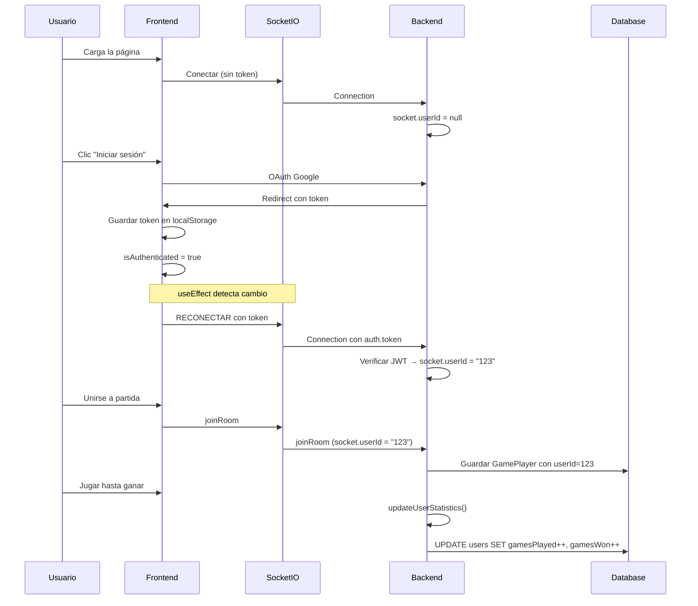

# 🔧 Fix: Socket.IO no recibía el token JWT

## 🐛 Problema Identificado

A través de los logs de debug, se identificó que el `socket.userId` siempre llegaba como `undefined` o `null`:

```bash
🔍 [DEBUG] joinRoom - socket.userId: undefined, userId a pasar: null, name: Valen
🔍 [DEBUG] joinRoom - socket.userId: null, userId a pasar: null, name: Ket
```

**Causa raíz**: El socket se creaba UNA SOLA VEZ cuando el componente App se montaba, pero en ese momento el usuario aún no estaba autenticado. Cuando el usuario se autenticaba después, el socket ya existente no se actualizaba con el nuevo token.

### Flujo del Problema

```
1. Usuario carga la página
2. App.jsx se monta → socket se crea SIN token (getToken() = null)
3. Usuario hace clic en "Iniciar sesión con Google"
4. OAuth callback → token guardado en localStorage
5. Usuario juega una partida
6. ❌ Socket sigue sin token (porque nunca se reconectó)
```

---

## ✅ Solución Implementada

### 1. Detectar cambios en autenticación

**Archivo**: `src/App.jsx`

```jsx
function App() {
  // Agregar isAuthenticated para detectar cambios
  const { getToken, isAuthenticated } = useAuth();
  // ...
}
```

### 2. Reconectar socket cuando cambia la autenticación

```jsx
useEffect(() => {
  const authToken = getToken();
  console.log(
    `🔍 [CLIENT] Inicializando socket. Token presente: ${!!authToken}, isAuthenticated: ${isAuthenticated}`
  );

  const instance = io(SOCKET_URL, {
    withCredentials: true,
    transports: ["websocket", "polling"],
    reconnection: true,
    reconnectionAttempts: 10,
    reconnectionDelay: 1000,
    reconnectionDelayMax: 5000,
    timeout: 20000,
    auth: {
      token: authToken, // ← Token actualizado
    },
  });
  setSocket(instance);

  instance.on("connect", () => {
    setSocketConnected(true);
    console.log("Conectado al servidor");
    console.log(
      `🔍 [CLIENT] Token enviado al servidor: ${
        authToken ? authToken.substring(0, 20) + "..." : "null"
      }`
    );
    // ...
  });

  // ... resto de listeners

  return () => {
    instance.disconnect(); // Importante: desconectar el socket anterior
  };
}, [getToken, isAuthenticated]); // ← Dependencias actualizadas
//           ^^^^^^^^^^^^^^^^ Se ejecuta cuando cambia la autenticación
```

### 3. Logs mejorados en el servidor

**Archivo**: `server/index.js`

```javascript
io.use((socket, next) => {
  const token = socket.handshake.auth?.token;
  console.log(
    `🔍 [SERVER] Middleware - Socket ${socket.id}, token presente: ${!!token}`
  );

  if (token) {
    try {
      const decoded = verifyToken(token);
      socket.userId = decoded.userId;
      console.log(
        `✅ Socket ${socket.id} autenticado como userId: ${decoded.userId}`
      );
    } catch (err) {
      console.log(`❌ Token inválido para socket ${socket.id}: ${err.message}`);
      socket.userId = null;
    }
  } else {
    console.log(`👤 Socket ${socket.id} sin token, continuando como invitado`);
    socket.userId = null;
  }

  next();
});
```

---

## 🧪 Cómo Verificar que Funciona

### Escenario 1: Usuario se autentica ANTES de jugar

```bash
# Cliente
🔍 [CLIENT] Inicializando socket. Token presente: false, isAuthenticated: false
Conectado al servidor
🔍 [CLIENT] Token enviado al servidor: null

# Usuario hace clic en "Iniciar sesión con Google"
# OAuth callback exitoso

🔍 [CLIENT] Inicializando socket. Token presente: true, isAuthenticated: true
Conectado al servidor
🔍 [CLIENT] Token enviado al servidor: eyJhbGciOiJIUzI1NiI...

# Servidor
🔍 [SERVER] Middleware - Socket xyz123, token presente: true
✅ Socket xyz123 autenticado como userId: a1b2c3d4-e5f6-...
```

### Escenario 2: Usuario juega como invitado

```bash
# Cliente
🔍 [CLIENT] Inicializando socket. Token presente: false, isAuthenticated: false
Conectado al servidor
🔍 [CLIENT] Token enviado al servidor: null

# Usuario se une a una partida directamente

# Servidor
🔍 [SERVER] Middleware - Socket xyz123, token presente: false
👤 Socket xyz123 sin token, continuando como invitado
🔍 [DEBUG] joinRoom - socket.userId: null, userId a pasar: null, name: Invitado
```

### Escenario 3: Usuario autenticado juega (CORRECTO)

```bash
# Cliente (después de autenticarse)
🔍 [CLIENT] Inicializando socket. Token presente: true, isAuthenticated: true
Conectado al servidor
🔍 [CLIENT] Token enviado al servidor: eyJhbGciOiJIUzI1NiI...

# Usuario se une a una partida

# Servidor
🔍 [SERVER] Middleware - Socket abc456, token presente: true
✅ Socket abc456 autenticado como userId: 12345678-abcd-...
🔍 [DEBUG] joinRoom - socket.userId: 12345678-abcd-..., userId a pasar: 12345678-abcd-...
🔍 [DEBUG] addPlayer - socketId: abc456, userId recibido: 12345678-abcd-...
🔍 [DEBUG] Guardando jugador - name: Juan Pérez, userId: 12345678-abcd-..., socketId: abc456
💾 Partida xyz guardada en DB (ID: 789)

# Al terminar la partida
📊 Actualizando estadísticas para partida xyz...
   ✅ Juan Pérez: 5 partidas, 2 ganadas
```

---

## 🎯 Comportamiento Esperado

### ✅ Lo que DEBE pasar ahora:

1. Usuario carga la página → Socket creado sin token
2. Usuario se autentica con Google → Socket se RECONECTA con token
3. Usuario crea/une partida → userId se guarda correctamente
4. Partida termina → Estadísticas se actualizan en la DB

### ⚠️ Consideración: Reconexión en medio de partida

Si un usuario se autentica MIENTRAS está en una partida:

- El socket se reconectará
- Podría perder la conexión momentánea
- El sistema de reconexión por token debería manejarlo

**Recomendación**: Sugerir al usuario que se autentique ANTES de jugar, o implementar autenticación sin reconexión (usando `socket.auth` update sin desconectar).

---

## 📊 Flujo Corregido



---

## 🧹 Limpieza Futura

Una vez confirmado que funciona, considerar:

1. **Remover logs de debug** (líneas con `🔍 [DEBUG]`)
2. **Optimizar reconexión**: Usar `socket.auth` para actualizar el token sin desconectar:

```javascript
// Alternativa más elegante (no implementada aún)
useEffect(() => {
  if (socket && isAuthenticated) {
    const token = getToken();
    socket.auth = { token };
    socket.disconnect().connect(); // Reconectar con nuevo auth
  }
}, [isAuthenticated]);
```

---

## ✨ Resultado Final

Ahora cuando un usuario:

- ✅ Se autentica → Socket se reconecta con token
- ✅ Juega una partida → userId se guarda correctamente
- ✅ Gana la partida → Estadísticas se actualizan
- ✅ Ve su perfil → Muestra datos reales de la DB

---

_Implementado el 18 de octubre de 2025_
_Problema original: socket.userId siempre era null_
